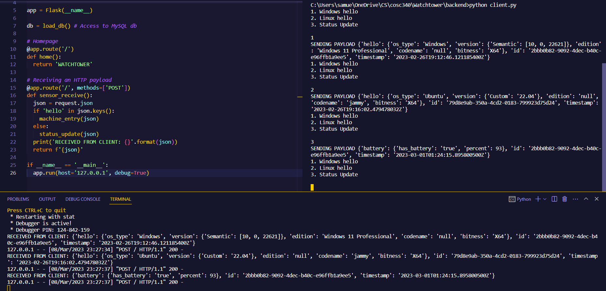

# Sprint 1

**Name**: Samuel Sui  
**Github ID**: SamJSui  
**Group name**:  Watchtower  

### What you planned to do
(Give a short bulleted list of the items you planned to do for this sprint. Include the github issue number and link to the issue)
- [#4](https://github.com/utk-cs340-spring23/Watchtower/issues/4)
- [#5](https://github.com/utk-cs340-spring23/Watchtower/issues/5)
- [#6](https://github.com/utk-cs340-spring23/Watchtower/issues/6)

### What you did not do
- Connect backend to sensors
- Connect backend to frontend

### What problems you encountered
- Negotiating with Clayton and rest of team on how implementation of the backend is going to work (hosted online or installed on each device)

### Issues you worked on
- [#4](https://github.com/utk-cs340-spring23/Watchtower/issues/4)
- [#5](https://github.com/utk-cs340-spring23/Watchtower/issues/5)
- [#6](https://github.com/utk-cs340-spring23/Watchtower/issues/6)

### Files you worked on
- *Watchtower/backend/db.py*
- *Watchtower/backend/client.py*
- *Watchtower/backend/server.py*

### What you accomplished
- For *db.py*, it was the most straight forward: create a function and return an object that has access to the MySQL database.
- *Client.py* is primarily for testing purposes. As *server.py is live and running on a locally hosted network, activity from *client.py* is able to send to payloads to the application, which the app can retrieve and parse data from. This is all in preparation for accepting JSON dumps from the sensors over a locally hosted port.
- *Server.py* is the primary backend which will serve to transport data from the sensors to the MySQL database, to the desktop application, and/or to the online website. *Server.py* receives a `MySQL.connector` object which can execute and run commands as if it was executing from the database's command line.

