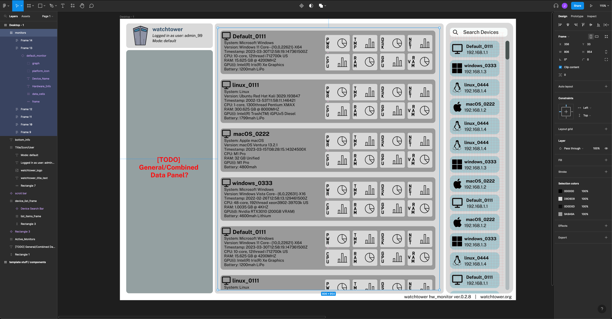

# Sprint 3 Reflection
Jacob Curlin

# What you planned to do
For Sprint 3, I aimed to implement the features listed below in the Darwin (MacOS) variant of our client sensor. 
Additionally, I planned on contributing to the frontend/UI design process, in order to provide a common design 
objective for my team members working on the actual javascript/python/php implementations.
- [CPU] Name / Max Clock Speed
- [CPU] Temperature / Current Clock Speed
- [GPU] Name / VRAM Size / Max Frequency
- [GPU] Temperature / Current VRAM Usage / Current Frequency

# What you did not do

  I was not satisfied with my progress on improving my component's error-handling implementation. I spent a significant amount of 
  time this sprint developing a thorough understanding of rust's error-handling syntax, and error-handling design at a higher level,
  looking into how several similar open-source products implement and structure theirs. I made small changes to my current implementation 
  of this but decided to table that issue until dependent issues such as a possible overhaul of the entire cross-platform sensor structure are addressed. 

- Disk Information
- GPU VRAM (complicated by shared memory pool)

# What problems you encountered

  The major design differences in Apple's ARM SOC's when compared to standard the x86 chipset introduced a variety of 
  complications when implementing features that appeared relatively trivial in the windows/linux distributions. I could
  have reverted to developing for older intel-based macos devices, but I chose to move forward since (A) my personal 
  machine is an arm-based variant, and (B) the incredibly low availability of similar functionality for apple silicon 
  that I observed in researching my own implementation could be a major selling-point in our product's real-world value. 

  The largest difficulties that I experienced were related to clock-speed data and CPU/GPU differentiation. Given the 
  SOC design of the platform, GPU and CPU are tightly interwoven, sharing the same memory pool, temperature sensors, 
  and PMU devices, issues that are exacerbated by Apple's closed-source practices. For example, despite extensive searching,
  I was unable to find any accurate method of obtaining CPU/GPU clock speed (frequency) with the exception of 'powermetrics',
  a closed-source apple command-line utility, demanding a shell-out and regex-parsing method of collection. There is a niche
  open-source solution to this in development based on reverse-engineering powermetrics that I may attempt to emulate in future
  revisions. Temperature readings were less-complex to retrieve, but I ran into additional difficulty when attempting to decipher
  the sensor labels I had gather, given that Apple does not publish the naming-scheme for their hardware in this context, and 
  other tools I found that seemed to have done so were paid, closed-source products. After some general chip-design research, 
  I settled on averaging the values of "PMU tdie" values, which I assumed designated the chip's power-management-unit cpu die 
  sensors. 

  In addition to getting my sensor implementations finalized, I've realized that the current, by-OS structure of our individual
  data sensors may need to be reworked to facilitate a modular, efficient data-polling loop. For example, repetitively re-calling 
  the processor frequency function utilizing 'powermetrics' is far from ideal, and does not make sense in contrast to an implementation
  that facilitates a continuously running 'powermetrics' parser that can itself be polled by a parent data-collection loop feeding 
  our server. In other words, this for this upcoming sprint, I am considering a design that allows individual sensors to run on their
  own contained collection-loops, in a way seperating the server update frequency from directly influencing data-collection implementation. 

- https://github.com/tlkh/asitop
- https://abhimanbhau.github.io/mac/m1-mac-power-usage-monitor/
- https://www.slideshare.net/kstan2/exploring-thermal-related-stuff-in-idevices-using-opensource-tool
- https://github.com/ThomasKaiser/Knowledge/blob/master/articles/Exploring_Apple_Silicon_on_MacBookAir10.md

# Issues you worked on

- https://github.com/utk-cs340-spring23/Watchtower/issues/23
- https://github.com/utk-cs340-spring23/Watchtower/issues/37
- https://github.com/utk-cs340-spring23/Watchtower/issues/38
- https://github.com/utk-cs340-spring23/Watchtower/issues/39
- https://github.com/utk-cs340-spring23/Watchtower/issues/40

# Files you worked on

- https://github.com/utk-cs340-spring23/Watchtower/blob/sprint3/watchtower-sensor/src/sys/darwin.rs
- https://github.com/utk-cs340-spring23/Watchtower/blob/sprint3/watchtower-sensor/src/error.rs
- https://github.com/utk-cs340-spring23/Watchtower/blob/sprint3/watchtower-sensor/Cargo.toml
- (removed watchtower-sensor/wrapper.h ; watchtower-sensor/build.rs)

# What you accomplished

- CPU Temperature, Clock Speed, Name
- GPU Temperature, Clock Speed, Name
- Refactored UUID collection to eliminate need for bindgen / manual FFI bindings
- Built a component-based UI prototype for our dashboard in Figma  

 
 
 

### Figma Design Prototype

https://www.figma.com/file/22ydxiYEuScbQa3hXy02Ov/watchtower_UI_draft1?node-id=0%3A3&t=Je7jTh5VqGXcOFY8-1

