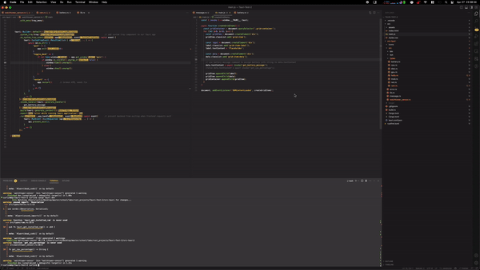

# Sprint 4 Reflection
Jacob Curlin

# What you planned to do

- Refactor some rushed sensor implementations
- Revise error handling
- Begin planning / implementation of lightweight client GUI / tray interface

# What you did not do

I wasn't able to make as many improvements to my sensor implementations as I would have liked, as I decided I was better off pushing forward with target features and revisiting such improvements in the last stretch of the project timeframe.
I also did not get as far as I would have liked with the GUI 'applet' dashboard implementation, however I laid significant foundation.

# What problems you encountered

I would have liked to have the GUI's data-fetching / display functionality ironed out, but struggled to come to a decision on how to implement this while balancing several other considerations. While I get these ironed out, I have commited my GUI work in another branch titled Tarui-GUI, as it needs a large amount of refactoring to merge with our current sensor implementation without serious conflicts. I'm writing this reflection on Friday, having just pushed a far-less-garbled refactor to the GUI branch, however the GIF demonstration I've provided below is a demonstration using the code written & commited pre-midnight 04/27.
Issues you worked on
I didn't utilize issues well this Sprint - with my sensor backend portion nearly fully-functional after the last couple of sprints, I spent this sprint searching for a new way to contribute value outside of the macos sensor component itself, without creating redundancy with my other group members' assigned goals.

# Files you worked on

- [Branch sprint4]

- https://github.com/utk-cs340-spring23/Watchtower/blob/sprint4/watchtower-sensor/src/sys/darwin.rs
- https://github.com/utk-cs340-spring23/Watchtower/blob/sprint4/watchtower-sensor/src/error.rs

- [Branch: Tarui-GUI]
- https://github.com/utk-cs340-spring23/Watchtower/blob/Tarui-GUI/src/index.html
- https://github.com/utk-cs340-spring23/Watchtower/blob/Tarui-GUI/src/main.js
- https://github.com/utk-cs340-spring23/Watchtower/blob/Tarui-GUI/src/styles.css
- https://github.com/utk-cs340-spring23/Watchtower/blob/Tarui-GUI/src-tauri/tauri.conf.json
- https://github.com/utk-cs340-spring23/Watchtower/blob/Tarui-GUI/src-tauri/Cargo.toml
- https://github.com/utk-cs340-spring23/Watchtower/blob/Tarui-GUI/src-tauri/src/main.rs

# What you accomplished
- [Darwin Sensor] Refactor of network sensor, improvements/fixes to GPU/CPU sensors, cleaned up / reworked error handling
- [GUI] Functional app template for quick-view stats dashboard and working system-tray icon with quit/toggle/restart functionality. Note, in gif below, dashboard is successfully pulling '100' battery percentage value for demonstration.

 
 
 

